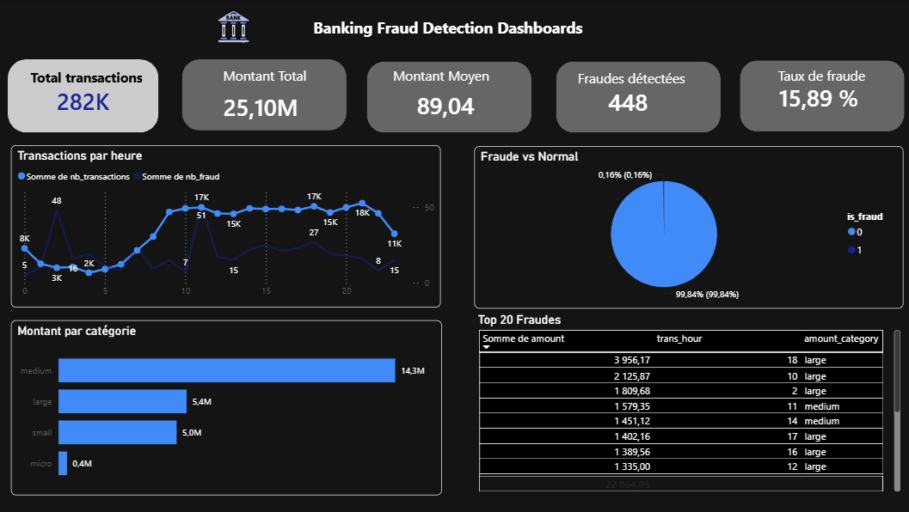

# 🕵️ Fraud Pipeline

End-to-end ETL pipeline for credit card fraud analysis — built with **PySpark**, **Apache Airflow**, **PostgreSQL**, and managed with **uv**.

## Overview

This project implements a daily-scheduled data engineering pipeline that ingests raw transaction data, cleans and enriches it with PySpark, computes fraud-related KPIs, and loads them into PostgreSQL for downstream analysis (e.g. Power BI).

The pipeline covers the full data lifecycle:

`raw CSV ingestion → PySpark cleaning/enrichment → KPI computation → PostgreSQL loading`

## Architecture

```
data/raw/
  └── fraudTrain.csv
         │
         ▼
  ┌───────────────────┐
  │  ingestion.py     │  PySpark — dropna/deduplication, filter amount > 0,
  │                   │  derive trans_hour + amount_category
  │                   │  → output/transactions_clean/ (Parquet)
  └────────┬──────────┘
           │
           ▼
  ┌───────────────────┐
  │  transform.py     │  PySpark — compute 5 KPI tables
  │                   │  → output/kpis/<kpi_name>/ (Parquet)
  └────────┬──────────┘
           │
           ▼
  ┌───────────────────┐
  │    load.py        │  psycopg2 — CREATE TABLE IF NOT EXISTS
  │                   │  + INSERT ... ON CONFLICT DO UPDATE / TRUNCATE+INSERT
  │                   │  → PostgreSQL (banking database)
  └───────────────────┘
```

- **Orchestration:** Apache Airflow DAG `Fraud_pipeline` (daily @ 06:00)
- **Infrastructure:** Docker Compose (Airflow + PostgreSQL)
- **Dependency management:** [uv](https://docs.astral.sh/uv/) (`pyproject.toml` + `uv.lock`)

## Dataset

The pipeline expects a CSV with these columns:

| Raw column | Renamed to | Notes |
|---|---|---|
| `Time` | `trans_time` | Seconds elapsed; used to derive `trans_hour` |
| `Amount` | `amount` | Transaction amount|
| `Class` | `is_fraud` | 0 = normal, 1 = fraud |

This matches the schema of the [Credit Card Fraud Detection dataset (ULB)](https://www.kaggle.com/datasets/mlg-ulb/creditcardfraud). Place your CSV at `data/raw/fraudTrain.csv`.

During ingestion, two columns are derived:
- `trans_hour` — hour of day extracted from `trans_time`
- `amount_category` — `micro` (<10), `small` (<100), `medium` (<1000), `large` (≥1000)

## KPIs Produced

| Table | Key | Columns | Description |
|---|---|---|---|
| `kpi_global` | — | nb_transactions, total_amount, avg_amount, max_amount, nb_fraud, fraud_rate_pct | Overall summary metrics |
| `kpi_by_hour` | `trans_hour` | trans_hour, nb_transactions, total_amount, avg_amount, nb_fraud, fraud_rate_pct | Transaction volume and fraud rate by hour of day |
| `kpi_by_amount_category` | `amount_category` | amount_category, nb_transactions, total_amount, avg_amount, nb_fraud, fraud_rate_pct | Volume and fraud rate by amount bucket |
| `kpi_fraud_vs_normal` | `is_fraud` | is_fraud, nb_transactions, total_amount, avg_amount, min_amount, max_amount | Aggregated comparison: fraud vs normal transactions |
| `kpi_top_fraud_amounts` | — | trans_time, amount, amount_category, trans_hour | Top 20 highest-value fraudulent transactions |


## Tech Stack

| Layer | Technology |
|---|---|
| Data processing | PySpark 3.5.7, pandas, pyarrow |
| Orchestration | Apache Airflow 2.8.1 (Python 3.10) |
| Storage | PostgreSQL 15, Parquet |
| Dependency management | uv |
| Infrastructure | Docker, Docker Compose |
| Code quality | ruff, pytest, pre-commit |
| Language | Python 3.10+ |

## Project Structure

```
Fraud_pipeline/
├── dags/
│   └── pipeline_dag.py       # Airflow DAG — orchestrates the full pipeline
├── scripts/
│   ├── __init__.py
│   ├── ingestion.py          # PySpark — read CSV, clean, enrich, save as Parquet
│   ├── transform.py          # PySpark — compute the 5 KPI tables
│   └── load.py               # psycopg2 — create tables & load KPIs into PostgreSQL
├── sql/
│   └── init_db.sql           # Creates the "banking" database
├── data/
│   └── raw/
│       └── fraudTrain.csv    # Source dataset (not versioned)
├── output/                   # Parquet outputs (not versioned)
│   ├── transactions_clean/
│   └── kpis/
├── logs/                     # Airflow logs
├── tests/                    # Unit tests
├── .env                      # Environment variables (not versioned)
├── .gitignore
├── docker-compose.yml        # Airflow + PostgreSQL services
├── Dockerfile                # Airflow image + Java 17 + uv-managed deps
├── pyproject.toml
└── uv.lock
```

## Getting Started

### Prerequisites

- Docker Desktop installed and running
- [uv](https://docs.astral.sh/uv/getting-started/installation/)

### 1. Clone the repository

```bash
git clone https://github.com/hajarelkamouni/banking-pipeline.git
cd Fraud_pipeline
```

### 2. Get the dataset

Download the CSV (see [Dataset](#dataset) above) and place it at `data/raw/fraudTrain.csv`.

### 3. Configure environment variables

```bash
cp .env.example .env
```


### 4. Start the infrastructure

```bash
docker-compose up -d
```

Wait a minute or two for Postgres and Airflow to initialize, then open [http://localhost:8080](http://localhost:8080).
Login: `airflow` / Password: `airflow`

### 5. Trigger the pipeline

In the Airflow UI:
1. Find the `Fraud_pipeline` DAG
2. Toggle it **ON**
3. Click **Trigger DAG** (play button)
4. Watch tasks turn green in the Graph view

### 6. Run locally (without Docker)

```bash
uv sync
uv run python scripts/ingestion.py
uv run python scripts/transform.py
uv run python scripts/load.py
```

## Airflow DAG

The `Fraud_pipeline` DAG runs daily at 06:00, with data-quality checks between each stage:

```
start
  └── check_source_file
        └── install_dependencies
              └── ingestion
                    └── check_parquet_output
                          └── transformation
                                └── check_kpis_output
                                      └── load_to_postgres
                                            └── end
```

## Environment Variables

| Variable | Default | Description |
|---|---|---|
| `POSTGRES_USER` / `POSTGRES_PASSWORD` / `POSTGRES_DB` | `airflow` | Airflow's internal metadata database |
| `BANKING_DB` / `BANKING_USER` / `BANKING_PASSWORD` | `banking` / `airflow` / `airflow` | Database used to store KPI tables |
| `POSTGRES_HOST` / `POSTGRES_PORT` | `postgres` / `5432` | Postgres connection info |
| `AIRFLOW_UID` | `50000` | UID used by Airflow containers |
| `RAW_DATA_PATH` | `/opt/airflow/data/raw/fraudTrain.csv` | Path to the source CSV |
| `OUTPUT_PATH` | `/opt/airflow/output` | Base path for Parquet outputs |

# 🕵️ Fraud Pipeline

End-to-end ETL pipeline for credit card fraud analysis — built with **PySpark**, **Apache Airflow**, **PostgreSQL**, and managed with **uv**.

## Overview

This project implements a daily-scheduled data engineering pipeline that ingests raw transaction data, cleans and enriches it with PySpark, computes fraud-related KPIs, and loads them into PostgreSQL for downstream analysis (e.g. Power BI).

The pipeline covers the full data lifecycle:

`raw CSV ingestion → PySpark cleaning/enrichment → KPI computation → PostgreSQL loading`

## Architecture

```
data/raw/
  └── fraudTrain.csv
         │
         ▼
  ┌───────────────────┐
  │  ingestion.py     │  PySpark — dropna/dedupe, filter amount > 0,
  │                   │  derive trans_hour + amount_category
  │                   │  → output/transactions_clean/ (Parquet)
  └────────┬──────────┘
           │
           ▼
  ┌───────────────────┐
  │  transform.py     │  PySpark — compute 5 KPI tables
  │                   │  → output/kpis/<kpi_name>/ (Parquet)
  └────────┬──────────┘
           │
           ▼
  ┌───────────────────┐
  │    load.py        │  psycopg2 — CREATE TABLE IF NOT EXISTS
  │                   │  + INSERT ... ON CONFLICT DO UPDATE / TRUNCATE+INSERT
  │                   │  → PostgreSQL (banking database)
  └───────────────────┘
```

- **Orchestration:** Apache Airflow DAG `Fraud_pipeline` (daily @ 06:00, no catchup)
- **Infrastructure:** Docker Compose (Airflow + PostgreSQL)
- **Dependency management:** [uv](https://docs.astral.sh/uv/) (`pyproject.toml` + `uv.lock`)

## Dataset

The pipeline expects a CSV with (at least) these columns:

| Raw column | Renamed to | Notes |
|---|---|---|
| `Time` | `trans_time` | Seconds elapsed; used to derive `trans_hour` |
| `Amount` | `amount` | Transaction amount; must be > 0 |
| `Class` | `is_fraud` | 0 = normal, 1 = fraud |

This matches the schema of the [Credit Card Fraud Detection dataset (ULB)](https://www.kaggle.com/datasets/mlg-ulb/creditcardfraud). Place your CSV at `data/raw/fraudTrain.csv` (path configurable via `RAW_DATA_PATH`).

During ingestion, two columns are derived:
- `trans_hour` — hour of day extracted from `trans_time`
- `amount_category` — `micro` (<10), `small` (<100), `medium` (<1000), `large` (≥1000)

## KPIs Produced

| Table | Key | Columns | Description |
|---|---|---|---|
| `kpi_global` | — | nb_transactions, total_amount, avg_amount, max_amount, nb_fraud, fraud_rate_pct | Overall summary metrics |
| `kpi_by_hour` | `trans_hour` | trans_hour, nb_transactions, total_amount, avg_amount, nb_fraud, fraud_rate_pct | Transaction volume and fraud rate by hour of day |
| `kpi_by_amount_category` | `amount_category` | amount_category, nb_transactions, total_amount, avg_amount, nb_fraud, fraud_rate_pct | Volume and fraud rate by amount bucket |
| `kpi_fraud_vs_normal` | `is_fraud` | is_fraud, nb_transactions, total_amount, avg_amount, min_amount, max_amount | Aggregated comparison: fraud vs normal transactions |
| `kpi_top_fraud_amounts` | — | trans_time, amount, amount_category, trans_hour | Top 20 highest-value fraudulent transactions |

Tables with a key column are upserted (`ON CONFLICT ... DO UPDATE`); tables without one are truncated and reloaded on each run.

## Tech Stack

| Layer | Technology |
|---|---|
| Data processing | PySpark 3.5.7, pandas, pyarrow |
| Orchestration | Apache Airflow 2.8.1 (Python 3.10) |
| Storage | PostgreSQL 15, Parquet |
| Dependency management | uv |
| Infrastructure | Docker, Docker Compose |
| Code quality | ruff, pytest, pre-commit |
| Language | Python 3.10+ |

## Project Structure

```
Fraud_pipeline/
├── dags/
│   └── pipeline_dag.py       # Airflow DAG — orchestrates the full pipeline
├── scripts/
│   ├── __init__.py
│   ├── ingestion.py          # PySpark — read CSV, clean, enrich, save as Parquet
│   ├── transform.py          # PySpark — compute the 5 KPI tables
│   └── load.py               # psycopg2 — create tables & load KPIs into PostgreSQL
├── sql/
│   └── init_db.sql           # Creates the "banking" database
├── data/
│   └── raw/
│       └── fraudTrain.csv    # Source dataset (not versioned)
├── output/                   # Parquet outputs (not versioned)
│   ├── transactions_clean/
│   └── kpis/
├── logs/                     # Airflow logs (not versioned)
├── tests/                    # Unit tests
├── .env                      # Environment variables (not versioned)
├── .gitignore
├── docker-compose.yml        # Airflow + PostgreSQL services
├── Dockerfile                # Airflow image + Java 17 + uv-managed deps
├── pyproject.toml
└── uv.lock
```

## Getting Started

### Prerequisites

- Docker Desktop installed and running
- [uv](https://docs.astral.sh/uv/getting-started/installation/) (only needed for local/non-Docker runs)

### 1. Clone the repository

```bash
git clone https://github.com/YOUR_USERNAME/Fraud_pipeline.git
cd Fraud_pipeline
```

### 2. Get the dataset

Download the CSV (https://www.kaggle.com/datasets/mlg-ulb/creditcardfraud/code) and place it at `data/raw/fraudTrain.csv`.

### 3. Configure environment variables

```bash
cp .env.example .env
```

Default values already work out of the box with Docker Compose.

### 4. Start the infrastructure

```bash
docker-compose up -d
```

Wait a minute or two for Postgres and Airflow to initialize, then open [http://localhost:8080](http://localhost:8080).
Login: `airflow` / Password: `airflow`

### 5. Trigger the pipeline

In the Airflow UI:
1. Find the `Fraud_pipeline` DAG
2. Toggle it **ON**
3. Click **Trigger DAG** (play button)
4. Watch tasks turn green in the Graph view

### 6. Run locally (without Docker)

```bash
uv sync
uv run python scripts/ingestion.py
uv run python scripts/transform.py
uv run python scripts/load.py
```


## Airflow DAG

The `Fraud_pipeline` DAG runs daily at 06:00, with data-quality checks between each stage:

```
start
  └── check_source_file
        └── install_dependencies
              └── ingestion
                    └── check_parquet_output
                          └── transformation
                                └── check_kpis_output
                                      └── load_to_postgres
                                            └── end
```

## Power BI Dashboard

Connect Power BI to PostgreSQL:

| Setting | Value |
|---|---|
| Server | `localhost` |
| Port | `5432` |
| Database | `banking` |
| Username | `airflow` |
| Password | `airflow` |

### Dashboard visuals

| Visual | Table used |
|---|---|
| KPI cards (total transactions, total amount, avg amount, fraud count, fraud rate) | `kpi_global` |
| Transactions per hour (line chart) | `kpi_by_hour` |
| Fraud vs Normal (pie chart) | `kpi_fraud_vs_normal` |
| Amount by category (bar chart) | `kpi_by_amount_category` |
| Top fraud amounts (table) | `kpi_top_fraud_amounts` |



## Environment Variables

| Variable | Default | Description |
|---|---|---|
| `POSTGRES_USER` / `POSTGRES_PASSWORD` / `POSTGRES_DB` | `airflow` | Airflow's internal metadata database |
| `BANKING_DB` / `BANKING_USER` / `BANKING_PASSWORD` | `banking` / `airflow` / `airflow` | Database used to store KPI tables |
| `POSTGRES_HOST` / `POSTGRES_PORT` | `postgres` / `5432` | Postgres connection info |
| `AIRFLOW_UID` | `50000` | UID used by Airflow containers |
| `RAW_DATA_PATH` | `/opt/airflow/data/raw/fraudTrain.csv` | Path to the source CSV |
| `OUTPUT_PATH` | `/opt/airflow/output` | Base path for Parquet outputs |


## Author

**Hajar Elkamouni** — Data Engineer

[LinkedIn](#) · [GitHub](#)
